

  

  <h3>
    Балтийский Федеральный Университет им. Иммануила Канта
  </h3>

  <h2>
    Основы построения многоканальных инфокоммуникационных систем и сетей
  </h2>

  <h1>
    Отчёт по лабораторной работе №1
  </h1>

  <h2>
    Исследование временно-частотных характеристик сигналов разной формы и амплитудно-модулированных сигналов
  </h2>

   

  <h4>
    Выполнил студент 3-го курса 
    направления «Информационная безопасность» 
    Мастерских Егор Александрович
  </h4>

  <h4>
    Преподаватель: 
    Молчанов Сергей Васильевич
  </h4>
  

  <h3 id="footer">
    Калининград 2024
  </h3>

## Задание 1. Проанализировать синусоидальный сигнал в частотной и временной областях при частоте дискретизации, соответствующей условию теоремы Котельникова, и при передискретизации с коэффициентами 10 и 100

<figure style="width: 50%;">
  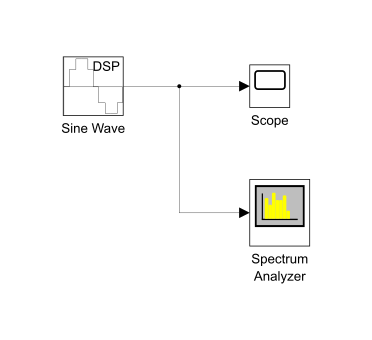
  <figcaption>
    Схема подключения блоков для анализа синусоидального сигнала
  </figcaption>
</figure>

Пусть $f = 100\ \text{Hz}$ (частота сигнала; ей соответствует параметр *Frequency* блока *Sine Wave*).

### Анализ сигнала при $f_\mathrm{d0} = 1\ \text{kHz}$

$f_\mathrm{d0} > 2f \Longrightarrow f_\mathrm{d0}$ удовлетворяет условию теоремы Котельникова.

Величине, обратной частоте дискретизации синусоидального сигнала, соответствует параметр *Sample time* блока *Sine Wave*:

| | |
| -- | -- |
| Sample time | 1 / 1e3 |

<table class="columns">
  <tr>
    <td width="55%">
    <figure>
      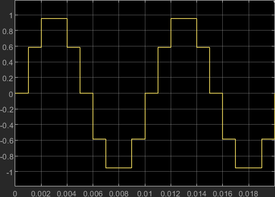
      <figcaption>
        Временная диаграмма синусоидального сигнала при $f_\mathrm{d} = 1\ \text{kHz}$. По диаграмме период сигнала $T = 0,01\ \text{s}$
      </figcaption>
    </figure>
    </td>
    <td>
    <figure>
      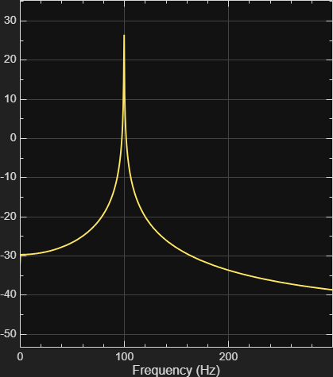
      <figcaption>
        Частотная диаграмма синусоидального сигнала при $f_\mathrm{d} = 1\ \text{kHz}$. По диаграмме $f = 100\ \text{Hz}$
      <figcaption>
    </figure>
    </td>
  </tr>
</table>

### Анализ сигнала при $f_\mathrm{d1} = 10f_\mathrm{d0}$

<table class="columns">
  <tr>
    <td width="55%">
    <figure>
      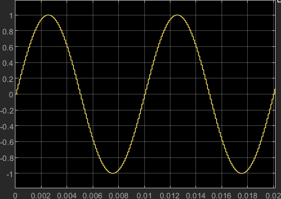
      <figcaption>
        Временная диаграмма синусоидального сигнала при $f_\mathrm{d} = 10\ \text{kHz}$
      </figcaption>
    </figure>
    </td>
    <td>
    <figure>
      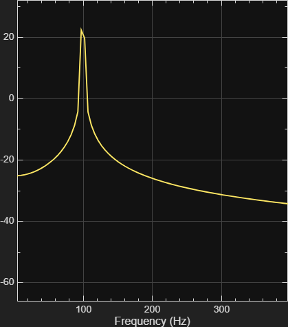
      <figcaption>
        Частотная диаграмма синусоидального сигнала при $f_\mathrm{d} = 10\ \text{kHz}$
      </figcaption>
    </figure>
    </td>
  </tr>
</table>

### Анализ сигнала при $f_\mathrm{d2} = 100 f_\mathrm{d0}$

<table class="columns">
  <tr>
    <td width="55%">
    <figure>
      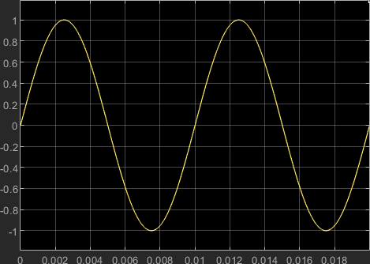
      <figcaption>
        Временная диаграмма синусоидального сигнала при $f_\mathrm{d} = 100\ \text{kHz}$
      </figcaption>
    </figure>
    </td>
    <td>
    <figure>
      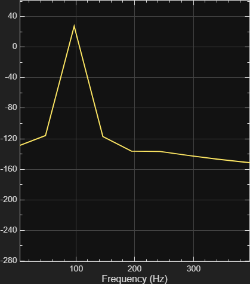
      <figcaption>
        Частотная диаграмма синусоидального сигнала при $f_\mathrm{d} = 100\ \text{kHz}$
      </figcaption>
    </figure>
    </td>
  </tr>
</table>

### Выводы к заданию 1

- Чем выше частота дискретизации, тем ближе дискретный синусоидальный сигнал к своему аналоговому прототипу;
- С каждым десятикратным увеличением $f_\mathrm{d}$ пик основной частоты $f$ на частотной диаграмме становится всё менее выраженным.

### О выборе значений частоты дискретизации $f_\mathrm{d}$ и частоты сигнала $f$

Наилучший результат от преобразования Фурье получается в случае, если:

$\dfrac{f_\mathrm{d}}{f} = 2^n$, где $n \in \mathbb{N}$

## Задание 2. Проанализировать умножение двух идентичных синусоидальных сигналов с частотой $f = 1\ \text{kHz}$ при двух значениях коэффициента модуляции $k_\mathrm{m}$

<figure style="width: 75%;">
  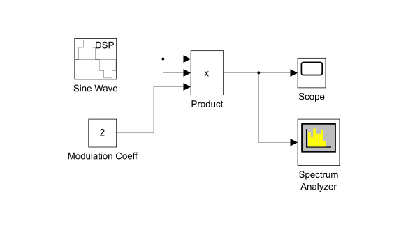
  <figcaption>
    Схема подключения блоков для анализа операции умножения двух идентичных синусоидальных сигналов и коэффициента модуляции
  </figcaption>
</figure>

Пусть:

- $A = 1$ (амплитуда генерируемого источником сигнала);
- $f_\mathrm{d} = 128\ \text{kHz}$ (частота дискретизации).

### Анализ результирующего сигнала при $k_\mathrm{m} = 2$

<table class="columns">
  <tr>
    <td width="55%">
    <figure>
      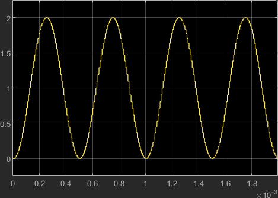
      <figcaption>
        Временная диаграмма результирующего сигнала при $k_\mathrm{m} = 2$. 
        По диаграмме период результирующего сигнала $T^\prime = 0,5\ \text{ms}$; амплитуда результирующего сигнала $A^\prime = 2$
      </figcaption>
    </figure>
    </td>
    <td>
    <figure>
      
      <figcaption>
        Частотная диаграмма результирующего сигнала при $k_\mathrm{m} = 2$. 
        По диаграмме частота результирующего сигнала $f^\prime = 2\ \text{kHz}$
      </figcaption>
    </figure>
    </td>
  </tr>
</table>

### Анализ результирующего сигнала при $k_\mathrm{m} = 3$

<table class="columns">
  <tr>
    <td width="55%">
    <figure>
      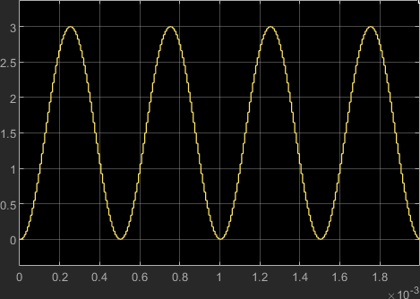
      <figcaption>
        Временная диаграмма результирующего сигнала при $k_\mathrm{m} = 3$. 
        По диаграмме $T^\prime = 0,5\ \text{ms}$, $A^\prime = 3$
      </figcaption>
    </figure>
    </td>
    <td>
    <figure>
      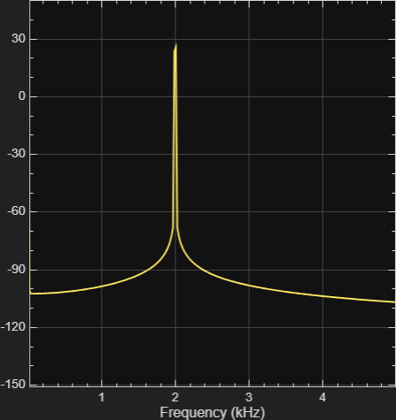
      <figcaption>
        Частотная диаграмма результирующего сигнала при $k_\mathrm{m} = 3$. 
      По диаграмме $f^\prime = 2\ \text{kHz}$
      </figcaption>
    </figure>
    </td>
  </tr>
</table>

### Выводы к заданию 2

- $f^\prime = 2f$;
- $A^\prime = k_\mathrm{m}A^2$.

## Задание 3. Проанализировать треугольный и прямоугольный сигналы с произвольными характеристиками в частотной и временной областях

<figure style="width: 50%;">
  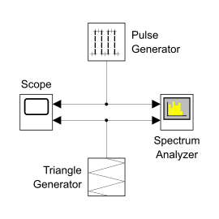
  <figcaption>
    Схема подключения блоков для анализа прямоугольного и треугольного сигналов
  </figcaption>
</figure>

Пусть:

- $f_\mathrm{d} = 512\ \text{kHz}$ (частота дискретизации, одинаковая для обоих сигналов);
- $f = 1\ \text{kHz}$ (частота сигналов, одинаковая для обоих);
- $w_\mathrm{p} = \frac{T}{4} = \frac{1}{4f}$ (ширина прямоугольного импульса).

Создадим соответствующие переменные:

| | |
| -- | -- |
| SampleFreq | 512e3 |
| SigFreq | 1e3 |

и зададим конфигурацию блоков:

| *Pulse Generator* | |
| -- | -- |
| Pulse type | Sample based |
| Sample time | 1 / SampleFreq |
| Period (number of samples) | SampleFreq / SigFreq |
| Pulse width (number of samples) | SampleFreq / (4 * SigFreq) |

| *Triangle Generator* | |
| -- | -- |
| Sample time | 1 / SampleFreq |
| Frequency (Hz) | SigFreq |

### Анализ прямоугольного и треугольного сигналов

<table class="columns">
  <tr>
    <td>
    <figure>
      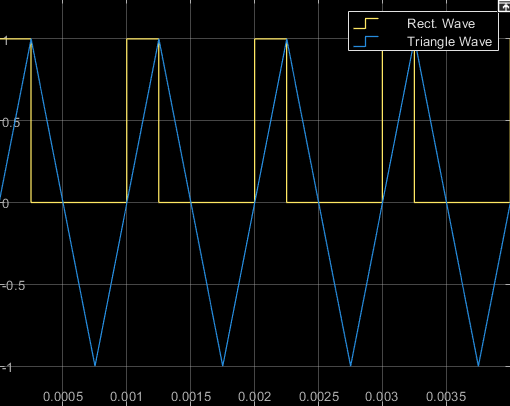
      <figcaption>
        Временная диаграмма прямоугольного и треугольного сигналов. 
        По диаграмме $T = 1\ \text{ms}$
      </figcaption>
    </figure>
    </td>
    <td width="55%">
    <figure>
      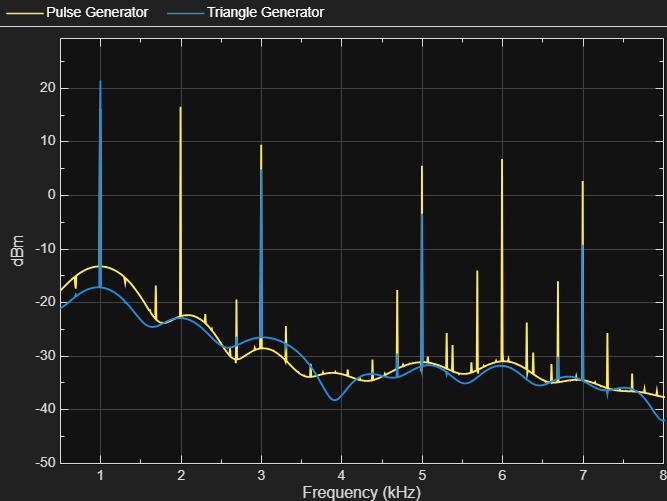
      <figcaption>
        Частотная диаграмма прямоугольного сигнала. 
        По диаграмме $f = 1\ \text{kHz}$
      </figcaption>
    </figure>
    </td>
  </tr>
</table>

### Выводы к заданию 3

# TODO
