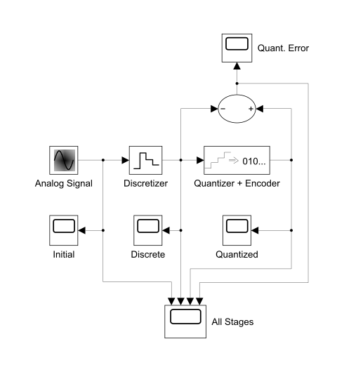
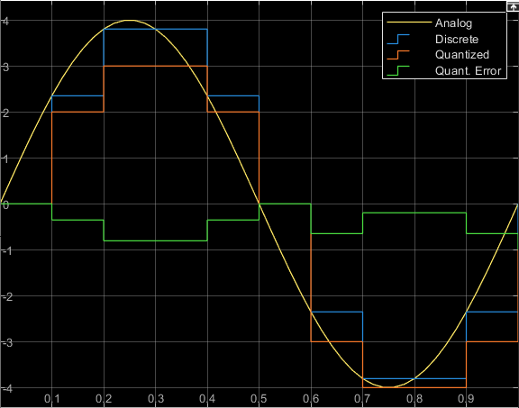
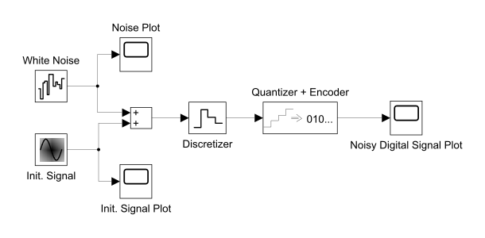
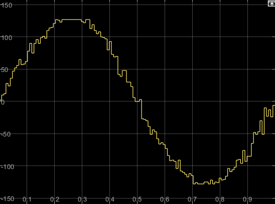
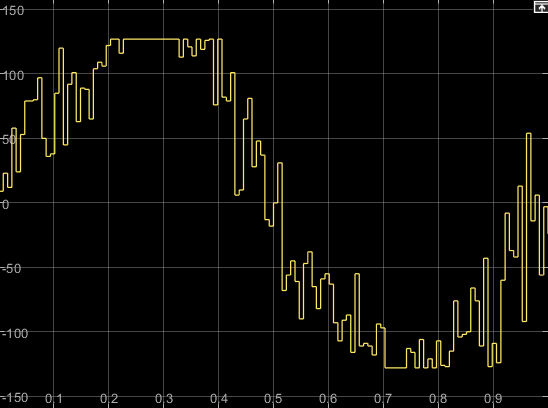
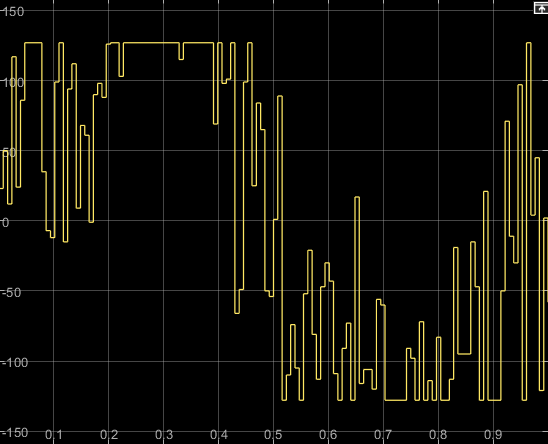




  2



  Импульсно-кодовая модуляция




### Цели работы

- исследовать последовательно кодированный сигнал ИКМ;
- исследовать зависимость отношения сигнала/шум системы ИКМ от величины помехи;
- исследовать свойства цифрового канала связи ИКМ.

## Задание 1. Построить ИКМ синусоидального сигнала

Пусть:

- $f = 1\ \text{Hz}$ (частота синусоидального сигнала);
- $f_\mathrm{d} = 10f$ (частота дискретизации);
- $q = 3\ \text{bit}$ (глубина квантования).

Значения параметров $f_\mathrm{d}$ и $q$ выбраны небольшими, чтобы разница между дискретным и квантованным сигналами и их аналоговым прототипом отображалась нагляднее на временной диаграмме.

Чтобы после кодирования цифрового сигнала его амплитуда соответствовала амплитуде его аналогового прототипа, количество уровней квантования цифрового сигнала должно равняться размаху аналогового прототипа:

$2^q = 2A \Longrightarrow A = 2^{q - 1}$

### Построение ИКМ синусоидального сигнала

<figure style="width: 70%;">
  
  <figcaption>
    Схема блоков для анализа ИКМ синусоидального сигнала
  </figcaption>
</figure>

| Analog Signal (Sine Wave) | |
| :-- | -- |
| Frequency (rad/sec) | 2 * pi |
| Amplitude | 4 |

| Discretizer  (Zero-Order Hold) | |
| :-- | -- |
| Sample time | 0.1 |

| Quantizer + Encoder  (Uniform Encoder) | |
| :-- | -- |
| Output type | Signed integer |
| Bits | 3 |
| Peak | 4 |

### Анализ ИКМ синусоидального сигнала

<figure style="width: 60%;">
  
  <figcaption>
    Временная диаграмма дискретного и квантованного сигналов, их аналогового прототипа и ошибки квантования
  </figcaption>
</figure>

Ошибка квантования на временной диаграмме меньше или равна, следовательно, квантование происходит с округлением в меньшую сторону.

## Задание 2. Проанализировать канал связи в зависимости от отношения сигнал/шум

### Начальные условия

Пусть:

- $f = 1\ \text{Hz}$ (частота синусоидального сигнала);
- $f_\mathrm{d} = 2^7 f$ (частота дискретизации);
- $f_\mathrm{w} = f_\mathrm{d}$ (частота белого шума);
- $q = 8\ \mathrm{bit}$ (глубина квантования).

Амплитуда $A$ синусоидального сигнала определяется по формуле:

$A = 2^{q - 1}$

### Модель

<figure>
  
  <figcaption>
    Схема блоков для анализа канала связи
  </figcaption>
</figure>

Чтобы лучше уследить связь между параметрами модели, создадим переменные рабочего пространства модели (Model Workspace):

| Name | Value |
| :-- | :-- |
| SigFreq | 1 |
| SampleFreq | 2^SigFreq |
| QuantDepth | 8 |

Определим параметры блоков модели с использованием данных переменных:

| Init. Signal (Sine Wave) |  |
| :-- | -- |
| Amplitude | 2^(QuantDepth - 1) |
| Frequency (rad/sec) | 2 * pi * SigFreq |

| White Noise  (Band-Limited White Noise) |  |
| :-- | -- |
| Sample time | 1 / SampleFreq |
| Seed | 13, *например* |

| Discretizer  (Zero-Order Hold) | |
| :-- | -- |
| Sample time | 1 / SampleFreq |

| Quantizer + Encoder  (Uniform Encoder) | |
| :-- | -- |
| Peak | 2^(QuantDepth - 1) |
| Bits | QuantDepth |
| Output type | Signed integer |

### Анализ канала связи в зависимости от отношения сигнал/шум

Введём величину $k$ — отношение амплитуды сигнала к эффективной амплитуде шума:

$k = \dfrac{A}{\sqrt{P_\mathrm{w}}}$,

Создадим соответствующую переменную *SigNoiseCoeff* в рабочем пространстве модели, — меняя её значение, будем анализировать канал связи.

Величина $P_\mathrm{w}$ соответствует параметру *Noise power* блока *White Noise:*

| White Noise | |
| :-- | -- |
| Noise power | (2^(QuantDepth - 1) / SigNoiseCoeff) ^ 2 |

<table class="columns">
<tr>
  <td>
    <figure>
      
      <figcaption>
        Временная диаграмма канала связи при $k = 200$, — минимальный уровень шума
      </figcaption>
    </figure>
  </td>
  <td style="width: 51%;">
    <figure>
      
      <figcaption>
        Временная диаграмма канала связи при $k = 50$, — средний уровень шума
      </figcaption>
    </figure>
  </td>
</tr>
<tr>
  <td colspan="2">
    <figure style="width: 50%;">
      
      <figcaption>
        Временная диаграмма канала связи при $k = 20$, — максимальный уровень шума
      </figcaption>
    </figure>
  </td>
</tr>
</table>

### Выводы к заданию 2

По диаграммам канала связи соотнесём приблизительные диапазоны значений $k$ и соответствующую оценку уровня шума:

- при $k \in [200; +\infty]$ сигнал виден отчётливо;
- при $k \in [50; 200)$ сигнал искажён шумом, но форма сигнала прослеживается;
- при $k \in (0; 50)$ форма сигнала прослеживается с трудом или вообще не прослеживается.


