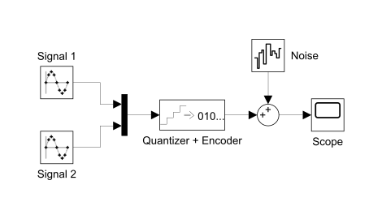
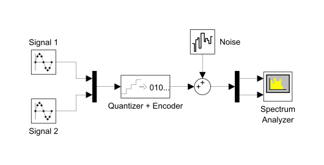




  3



  Построение двухканальной ИКМ системы




**Цель работы**: изучить принцип временного разделения каналов.

## Задание 1. Построить модель двухканальной системы связи ИКМ

<!-- (показать параметры блоков, последовательно отобразить скриншоты входных и выходных сигналов каждого блока) -->

Пусть:

|  | Описание параметра |
| :-- | :-- |
| $f_1 = 1\ \text{Hz}$ | частота первого сигнала |
| $f_2 = 2^1 f_1$ | частота второго сигнала |
| $f_\mathrm{d} = 2^7 f_1$ | частота дискретизации |
| $q = 8\ \text{bit}$ | глубина квантования |
| $A_1 = A_2 = A$ | амплитуды сигналов одинаковы |
| $\text{SNR} = 10$ | отношение сигнал/шум, инициализированное первым из трёх значений |

Производные параметры:

|  | Описание |
| :-- | :-- |
 | $A = 2^{q - 1} \Longleftarrow 2^q = 2A$ | амплитуда сигнала из условия согласования амплитуд сигнала до и после квантования |
| $\begin{matrix*}[l] P_\mathrm{n} = \dfrac{A^2}{10^\text{SNR}} \\ \Longleftarrow \text{SNR} = \log_{10} \left(\dfrac{A^2}{P_\mathrm{n}}\right) \end{matrix*}$ | мощность шума из определения отношения сигнал/шум |

### Модель

<figure style="width: 90%;">
  
  <figcaption>
    Модель двухканальной системы связи ИКМ
  </figcaption>
</figure>

| Model Workspace  Variables |  |
| :-- | -- |
| f1 | 1 |
| f2 | 2 |
| fd | 128 |
| q | 8 |
| SNR | 10 |

| _(Signal 1 \|\| Signal 2)_  (Sine Wave) |  |
| :-- | -- |
| Sine type | Sample based |
| Amplitude | 2^(q - 1) |
| Samples per period | fd / _(f1 \|\| f2)_ |
| Sample time | 1 / fd |

| Quantizer + Encoder  (Uniform Encoder) |  |
| :-- | -- |
| Peak | 2^(q - 1) |
| Bits | q |
| Output type | Signed integer |

| Noise  (Band-Limited White Noise) |  |
| :-- | -- |
| Noise power | (2^(q - 1)) ^ 2 / (10^SNR) |
| Sample time | 1 / fd |

## Задание 2. Изучить поведение канала при разделении канальных сигналов для значений уровня отношения сигнал/шум: 10, 5, 2

<table class="columns">
<tr valign="top">
  <td>
    <figure>
      
      <figcaption>
        Временная диаграмма канальных сигналов при $\text{SNR} = 10$, — минимальный шум
      </figcaption>
    </figure>
  </td>
  <td>
    <figure>
      
      <figcaption>
        Временная диаграмма канальных сигналов при $\text{SNR} = 5$, — средний уровень шума
      </figcaption>
    </figure>
  </td>
</tr>
<tr>
  <td colspan="2">
    <figure style="width: 50%;">
      
      <figcaption>
        Временная диаграмма канальных сигналов при $\text{SNR} = 2$, — максимальный шум
      </figcaption>
    </figure>
  </td>
</tr>
</table>

## Задание 3. Исследовать характеристики модели системы связи в частотной области

<figure>
  
  <figcaption>
    Схема исследования модели системы связи в частотной области
  </figcaption>
</figure>

<table class="columns">
<tr valign="top">
  <td>
    <figure>
      
      <figcaption>
        Частотная диаграмма канальных сигналов при $\text{SNR} = 10$ 
        На диаграмме хорошо видно, что $f_1 = 1\ \text{Hz}$, $f_2 = 2\ \text{Hz}$
      </figcaption>
    </figure>
  </td>
  <td>
    <figure>
      
      <figcaption>
        Частотная диаграмма канальных сигналов при $\text{SNR} = 5$
      </figcaption>
    </figure>
  </td>
</tr>
<tr>
  <td colspan="2">
    <figure style="width: 50%;">
      
      <figcaption>
        Частотная диаграмма канальных сигналов при $\text{SNR} = 2$
      </figcaption>
    </figure>
  </td>
</tr>
</table>

## Задание 4. Сделать вывод о работоспособности канала связи в зависимости от качества сигнала

На всех трёх частотных диаграммах хорошо видны частоты канальных сигналов ($f_1 = 1\ \text{Hz}$, $f_2 = 2\ \text{Hz}$).
То есть даже при высоком уровне шума в канале легко выделить сигнал.
Другими словами, представленная двухканальная система связи имеет высокую помехоустойчивость.

