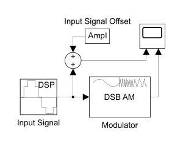
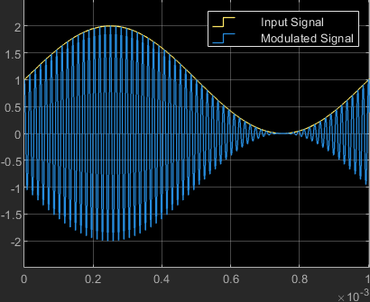




  4



  Моделирование многоканальной системы связи с частотным разделением сигналов




## Задание 1. Построить модель первичной группы (ПГ): 12 каналов тональной частоты, с однократным преобразованием с помощью несущих частот 64, 68, 72, .., 108 кГц

Введём обозначения:

- $f_\text{c min} = 64\ \text{kHz}$ — минимальная несущая частота
- $f_\text{c max} = 108\ \text{kHz}$ — максимальная несущая частота
- $h = 4\ \text{kHz}$ — шаг между несущими частотами соседних каналов

### Модель одного канала

Пусть:

- $A = 1$ — амплитуда входного сигнала, одинаковая для всех каналов
- $f = 1\ \text{kHz}$ — частота входного сигнала, одинаковая для всех каналов

Далее выберем частоту дискретизации, такую, чтобы при наибольшей несущей частоте, на одном периоде несущего сигнала вместилось хотя бы $2^3$ отсчётов. Пусть, например:

$\begin{matrix*}[l] \mathop{\mathrm{lb}} f_\mathrm{d} = \lfloor \mathop{\mathrm{lb}} (2^3 \cdot f_\text{c max}) \rfloor + 1 \Longrightarrow \\ f_\mathrm{d} = 1024\ \text{kHz} \end{matrix*}$

#### Построение модели одного канала в Simulink

| Model Workspace  Variables | |
| :-- | :-- |
| Ampl | 1 |
| f | 1e3 |
| f_d | 1024e3 |
| f_c_min | 64e3 |

Для наглядности связи между входным сигналом и огибающей модулированного сигнала построим модель так, чтобы отобразить оба сигнала на одной диаграмме.

Учтём следующее: чтобы частота огибающих модулированного сигнала соответствовала частоте входного сигнала, следует ввести сдвиг входного сигнала на величину амплитуды (входного сигнала).

Этим двум условиям соответствует следующая схема:

<figure style="width: 60%">

<figcaption>
  Схема одного канала с отображением на диаграмме модулированного и огибающего (он же входной) сигналов
</figcaption>
</figure>

Задаём конфигурацию блоков:

| Input Signal  (Sine Wave) | |
| :-- | :-- |
| Amplitude | Ampl |
| Frequency (Hz) | f |
| Sample mode | Discrete |
| Sample time | 1 / f_d |

| Modulator  (DSB AM Modulator Passband) | |
| :-- | :-- |
| Input signal offset | Ampl |
| Carrier frequency (Hz) | f_c_min |

И после симуляции получаем следующую временную диаграмму:

<figure style="width: 60%">

<figcaption>
  Временная диаграмма модулированного сигнала с несущей частотой $f_\text{c min}$
</figcaption>
</figure>

### Модель первичной группы

## Задание 2. Построить модель выделения индивидуального сигнала из группового, провести сравнительный анализ характеристик входного и выходного сигнала, объяснить причины отличий

