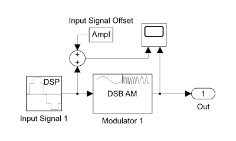
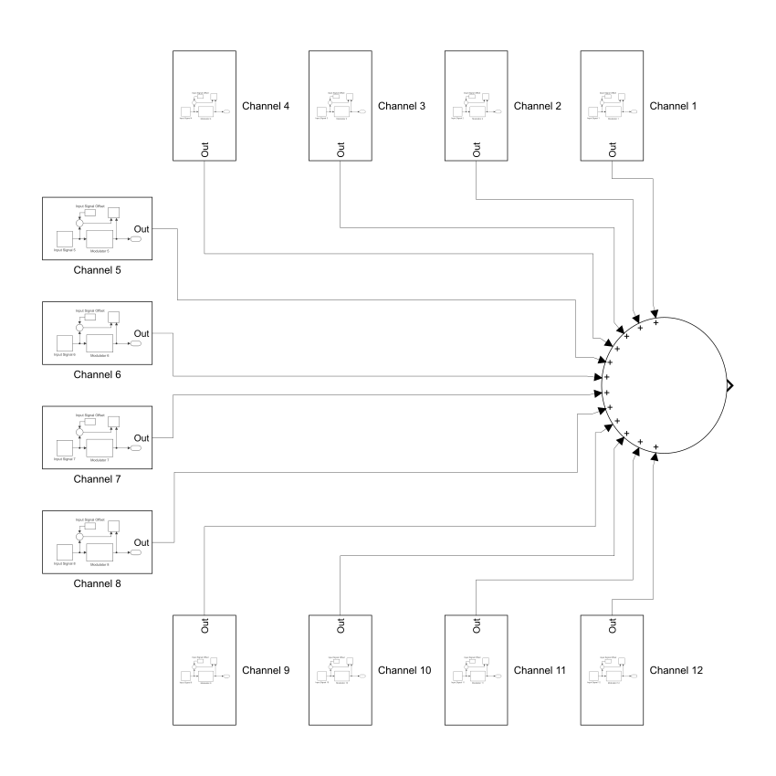




  4



  Моделирование многоканальной системы связи с частотным разделением сигналов




## Задание 1. Построить модель первичной группы (ПГ): 12 каналов тональной частоты, с однократным преобразованием с помощью несущих частот 64, 68, 72, .., 108 кГц

Введём обозначения:

- $f_\text{c min} = 64\ \text{kHz}$ — минимальная несущая частота
- $h = 4\ \text{kHz}$ — шаг между несущими частотами соседних каналов
- $f_\text{c max} = 108\ \text{kHz}$ — максимальная несущая частота

Амплитуду входного сигнала зададим одинаковой для всех каналов и равной единице.

Частоту дискретизации выберем такой, чтобы при наибольшей несущей частоте на одном периоде несущего сигнала вместилось хотя бы $2^3$ отсчётов.
Пусть, например:

$f_\mathrm{d} = 1024\ \text{kHz} \Longleftarrow \mathop{\mathrm{lb}} f_\mathrm{d} = \lfloor \mathop{\mathrm{lb}} (2^3 \cdot f_\text{c max}) \rfloor + 1$

В качестве входных канальных сигналов возьмём, например, ступени «Соль» и «Ля» контр-, большой, малой и трёх первых октав.
И распределим их по каналам, например, так:

- $f_1 = 49\ \text{Hz}$ — «Соль» контроктавы
- $f_2 = 55\ \text{Hz}$ — «Ля» контроктавы
- $f_3 = 98\ \text{Hz}$ — «Соль» большой октавы 
- $f_4 = 110\ \text{Hz}$ — «Ля» большой октавы
- $f_5 = 196\ \text{Hz}$ — «Соль» малой октавы
- $f_6 = 220\ \text{Hz}$ — «Ля» малой октавы
- $f_7 = 392\ \text{Hz}$ — «Соль» первой октавы
- $f_8 = 440\ \text{Hz}$ — «Ля» первой октавы
- $f_9 = 784\ \text{Hz}$ — «Соль» второй октавы
- $f_{10} = 880\ \text{Hz}$ — «Ля» второй октавы
- $f_{11} = 1568\ \text{Hz}$ — «Соль» третьей октавы 
- $f_{12} = 1760\ \text{Hz}$ — «Ля» третьей октавы

Введём теперь соответствующие параметры модели в Simulink:

| Model Workspace  Variables | |
| :-- | :-- |
| f_c_min | 64e3 |
| h | 4e3 |
| Ampl | 1 |
| f_d | 1024e3 |
| f_1 | 49 |
| f_2 | 55 |
| f_3 | 98 |
| f_4 | 110 |
| f_5 | 196 |
| f_6 | 220 |
| f_7 | 392 |
| f_8 | 440 |
| f_9 | 784 |
| f_10 | 880 |
| f_11 | 1568 |
| f_12 | 1760 |

### Модель $k$-го канала

Для наглядности связи между входным сигналом и огибающей модулированного сигнала построим модель так, чтобы отобразить оба сигнала на одной диаграмме.

Учтём следующее: чтобы частота огибающих модулированного сигнала соответствовала частоте входного сигнала, следует ввести сдвиг входного сигнала на величину амплитуды (входного сигнала).

Этим двум условиям соответствует схема, например, первого канала.
Для остальных каналов схема аналогична.

<figure style="width: 66%">

<figcaption>
  Схема 1-го канала
</figcaption>
</figure>

Задаём конфигурацию блоков:

| Input Signal  (Sine Wave) | |
| :-- | :-- |
| Amplitude | Ampl |
| Frequency (Hz) | f_$k$ |
| Sample mode | Discrete |
| Sample time | 1 / f_d |

| Modulator  (DSB AM Modulator Passband) | |
| :-- | :-- |
| Input signal offset | Ampl |
| Carrier frequency (Hz) | f_c_min + $(k - 1)$ * h |

После симуляции получаем временную диаграмму с модулированным и входным сигналами:

<figure style="width: 60%">

<figcaption>
  Временная диаграмма 12-го канала
</figcaption>
</figure>

### Схема первичной группы

<figure>

<figcaption>
  Схема первичной группы
</figcaption>
</figure>

## Задание 2. Построить модель выделения индивидуального сигнала из группового, провести сравнительный анализ характеристик входного и выходного сигналов

