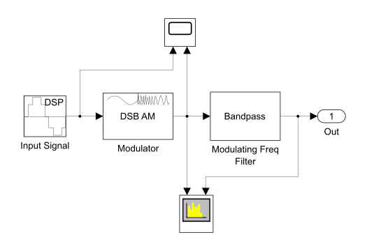
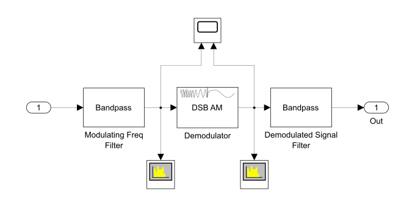




  4



  Моделирование многоканальной системы связи с частотным разделением сигналов




## Задание. Построить модель выделения индивидуального сигнала из группового: 12 каналов тональной частоты, с однократным преобразованием с помощью несущих частот 64, 68, 72, .., 108 кГц. Провести сравнительный анализ характеристик входного и выходного сигналов

#### Обозначения

<table>
  <tr>
    <td style="text-align: right;">$n$</td>
    <td>общее количество каналов в группе</td>
  </tr>
  <tr>
    <td style="text-align: right;">$k$</td>
    <td>номер канала</td>
  </tr>
  <tr>
    <td style="text-align: right;">$f_{\text{c} \mkern 2mu k}$</td>
    <td>несущая частота сигнала $k$-го канала</td>
  </tr>
  <tr>
    <td style="text-align: right;">$\Delta f_\text{c}$</td>
    <td>шаг между значениями несущих частот соседних каналов</td>
  </tr>
  <tr>
    <td style="text-align: right;">$f_\text{d}$</td>
    <td>частота дискретизации канального сигнала</td>
  </tr>
  <tr>
    <td style="text-align: right;">$A$</td>
    <td>амплитуда входного сигнала, одинаковая для всех каналов</td>
  </tr>
  <tr>
    <td style="text-align: right;">$f_k$</td>
    <td>частота входного сигнала $k$-го канала</td>
  </tr>
  <tr>
    <td style="text-align: right;">$f_\text{max}$</td>
    <td>максимальная частота входного канального сигнала</td>
  </tr>
  <tr>
    <td style="text-align: right;">$\Delta f$</td>
    <td>шаг между ближайшими значениями частот входных сигналов</td>
  </tr>
  <tr>
    <td style="text-align: right;">$f_{\text{m} \mkern 2mu k} = f_k + f_{\text{c} \mkern 2mu k}$</td>
    <td>модулированная частота сигнала $k$-го канала</td>
  </tr>
  <tr>
    <td style="text-align: right;">$\xi > 2$</td>
    <td>количество отсчётов, приходящихся на период модулированного сигнала с наибольшей модулирующей частотой</td>
  </tr>
  <tr>
    <td style="text-align: right;">
      $f_{\text{stop} 1 \mkern 2mu k}$, $f_{\text{stop} 2 \mkern 2mu k}$ 
      $f_{\text{pass} 1 \mkern 2mu k}$, $f_{\text{pass} 2 \mkern 2mu k}$
    </td>
    <td>частоты левой и правой границ полосы задерживания и левой и правой границ полосы пропускания соответственно полосового фильтра $k$-го канала</td>
  </tr>
</table>

### Дано

- $f_{\text{c} \mkern 1mu 1} = 64\ \text{kHz}$
- $\Delta f_\text{c} = 4\ \text{kHz}$
- $f_{\text{c} \mkern 2mu k} = f_{\text{c} \mkern 1mu 1} + (k - 1) \cdot \Delta f_\text{c}$
- $f_\text{max} < \Delta f_\text{c}$

### Решение

<figure style="width: 80%;">
  
  <figcaption>
    Модель выделения индивидуального сигнала из первичной группы
  </figcaption>
</figure>

#### Пусть

- $A = 1\mkern 9mu \forall\ k = 1\ldots n$
- $f_\text{max} = 0.5 \cdot \Delta f_\text{c} = 2\ \text{kHz}$
- $f_\text{min} = 0.5\ \text{kHz}$
- $\Delta f = 100\ \text{Hz}$
- $f_k$ — случайная величина; $\Omega_{f_k} = [f_\text{min}\ldots f_\text{max},\ \Delta f]$
- $\xi = 2^3$
- $f_\text{d} = 2^{\left\lceil \mathop{\mathrm{lb}} \left(\xi \cdot f_{\text{m} \mkern 2mu n}\right) \right\rceil} = 1\,048\,576\ \text{Hz}$ Таким образом $f_\text{d}$ равна ближайшей (в большую сторону) степени двойки, такой, что на период модулированного сигнала с наибольшей модулирующей частотой приходится $\xi$ отсчётов.
- $f_{\text{pass} 1 \mkern 2mu k} = f_{\text{m} \mkern 2mu k} - 0.5 \cdot \Delta f$
- $f_{\text{pass} 2 \mkern 2mu k} = f_{\text{m} \mkern 2mu k} + 0.5 \cdot \Delta f$
- $f_{\text{stop} 1 \mkern 2mu k} = f_{\text{pass} 1 \mkern 2mu k} - 0.5 \cdot \Delta f$
- $f_{\text{stop} 2 \mkern 2mu k} = f_{\text{pass} 2 \mkern 2mu k} + 0.5 \cdot \Delta f$

#### Модель $k$-го канала

<figure style="width: 80%;">
  
  <figcaption>
    Модель одного канала
  </figcaption>
</figure>

<table class="columns">
<tr valign="bottom">
  <td>
    <figure>
      
      <figcaption>
        Временные диаграммы канального сигнала
      </figcaption>
    </figure>
  </td>
  <td>
    <figure>
      
      <figcaption>
        Частотные диаграммы канального сигнала
      </figcaption>
    </figure>
  </td>
</tr>
</table>

Зачем модулировать входной сигнал?

TODO

Зачем фильтровать модулированный сигнал?

TODO

#### Групповой сигнал

<figure style="width: 80%;">
  
  <figcaption>
    Частотная диаграмма группового сигнала
  </figcaption>
</figure>

#### Модель выделителя индивидуального сигнала

<figure>
  
  <figcaption>
    Модель выделителя индивидуального сигнала
  </figcaption>
</figure>


