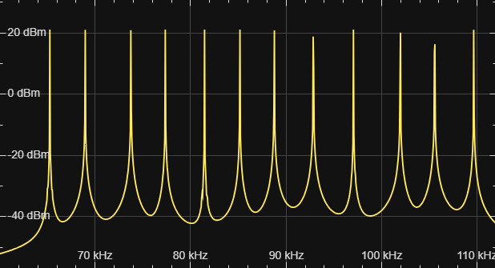




  4



  Моделирование многоканальной системы связи с частотным разделением сигналов




## Задание. Построить модель выделения индивидуального сигнала из группового: 12 каналов тональной частоты, с однократным преобразованием с помощью несущих частот 64, 68, 72, .., 108 кГц. Провести сравнительный анализ характеристик входного и выходного сигналов

#### Обозначения

<table>
  <tr>
    <td style="text-align: right;">$n$</td>
    <td>общее количество каналов в группе</td>
  </tr>
  <tr>
    <td style="text-align: right;">$k$</td>
    <td>номер канала</td>
  </tr>
  <tr>
    <td style="text-align: right;">$f_{\text{c} \mkern 2mu k}$</td>
    <td>несущая частота сигнала $k$-го канала</td>
  </tr>
  <tr>
    <td style="text-align: right;">$\Delta f_\text{c}$</td>
    <td>шаг между значениями несущих частот соседних каналов</td>
  </tr>
  <tr>
    <td style="text-align: right;">$f_\text{d}$</td>
    <td>частота дискретизации канального сигнала</td>
  </tr>
  <tr>
    <td style="text-align: right;">$A$</td>
    <td>амплитуда входного сигнала, одинаковая для всех каналов</td>
  </tr>
  <tr>
    <td style="text-align: right;">$f_k$</td>
    <td>частота входного сигнала $k$-го канала</td>
  </tr>
  <tr>
    <td style="text-align: right;">$f_\text{max}$</td>
    <td>максимальная частота входного канального сигнала</td>
  </tr>
  <tr>
    <td style="text-align: right;">$\Delta f$</td>
    <td>шаг между ближайшими значениями частот входных сигналов</td>
  </tr>
  <tr>
    <td style="text-align: right;">$f_{\text{m} \mkern 2mu k} = f_k + f_{\text{c} \mkern 2mu k}$</td>
    <td>модулированная частота сигнала $k$-го канала</td>
  </tr>
  <tr>
    <td style="text-align: right;">$\xi > 2$</td>
    <td>количество отсчётов, приходящихся на период модулированного сигнала с наибольшей модулированной частотой</td>
  </tr>
  <tr>
    <td style="text-align: right;">$f_k^\text{ext}$</td>
    <td>частота содержащего информацию сигнала $k$-го канала после выделения</td>
  </tr>
  <tr>
    <td style="text-align: right;">
      $f_{\text{stop} 1 \mkern 2mu k}$, $f_{\text{stop} 2 \mkern 2mu k}$ 
      $f_{\text{pass} 1 \mkern 2mu k}$, $f_{\text{pass} 2 \mkern 2mu k}$
    </td>
    <td>частоты левой и правой границ полосы задерживания и левой и правой границ полосы пропускания соответственно полосового фильтра $k$-го канала</td>
  </tr>
  <tr>
    <td style="text-align: right;">
      $f_{\text{stop} 1 \mkern 2mu k}^\text{ext}$, $f_{\text{stop} 2 \mkern 2mu k}^\text{ext}$ 
      $f_{\text{pass} 1 \mkern 2mu k}^\text{ext}$, $f_{\text{pass} 2 \mkern 2mu k}^\text{ext}$
    </td>
    <td>частоты левой и правой границ полосы задерживания и левой и правой границ полосы пропускания соответственно полосового фильтра *выделителя* $k$-го канала</td>
  </tr>
  <tr>
    <td style="text-align: right;">
      $f_{\text{cut} \mkern 2mu k}^\text{ext}$
    </td>
    <td>частота среза демодулятора</td>
  </tr>
  <tr>
    <td style="text-align: right;">
      $f_{\text{stop1} \mkern 2mu k}^{\prime\,\text{ext}}$,
      $f_{\text{stop2} \mkern 2mu k}^{\prime\,\text{ext}}$, 
      $f_{\text{pass1} \mkern 2mu k}^{\prime\,\text{ext}}$,
      $f_{\text{pass2} \mkern 2mu k}^{\prime\,\text{ext}}$
    </td>
    <td>частоты левой и правой границ полосы задерживания и левой и правой границ полосы пропускания соответственно полосового фильтра выделителя *демодулированного сигнала* $k$-го канала </td>
  </tr>
</table>

### Дано

- $f_{\text{c} \mkern 1mu 1} = 64\ \text{kHz}$
- $\Delta f_\text{c} = 4\ \text{kHz}$
- $f_{\text{c} \mkern 2mu k} = f_{\text{c} \mkern 1mu 1} + (k - 1) \cdot \Delta f_\text{c}$
- $f_\text{max} < \Delta f_\text{c}$

### Решение

<figure style="width: 80%;">
  
  <figcaption>
    Модель выделения индивидуального сигнала из первичной группы
  </figcaption>
</figure>

#### Пусть

- $A = 1\mkern 9mu \forall\ k = 1\ldots n$
- $f_\text{max} = 0.5 \cdot \Delta f_\text{c} = 2\ \text{kHz}$
- $f_\text{min} = 0.5\ \text{kHz}$
- $\Delta f = 100\ \text{Hz}$
- $f_k$ — случайная величина; $\Omega_{f_k} = [f_\text{min}\ldots f_\text{max},\ \Delta f]$
- $\xi = 2^3$
- $f_\text{d} = 2^{\left\lceil \mathop{\mathrm{lb}} \left(\xi \cdot f_{\text{m} \mkern 2mu n}\right) \right\rceil} = 1\,048\,576\ \text{Hz}$ Таким образом $f_\text{d}$ равна ближайшей (в большую сторону) степени двойки, такой, что на период модулированного сигнала с наибольшей модулирующей частотой приходится $\xi$ отсчётов.

#### Модель $k$-го канала

<figure style="width: 80%;">
  
  <figcaption>
    Модель одного канала
  </figcaption>
</figure>

Если суммировать непреобразованные входные канальные сигналы, их частотные спектры могут налагаться друг на друга, поэтому выделение сигнала определённого канала может быть затруднительным.
С помощью модуляции каждому каналу ставится в соответствие свой уникальный диапазон частот, в котором может находиться входной сигнал.

<table class="columns">
<tr valign="top">
  <td style="width: 55%;">
    <figure>
      
      <figcaption>
        Канальный сигнал на входе и после модуляции
      </figcaption>
    </figure>
  </td>
  <td>
    <figure>
      
      <figcaption>
        Частотная диаграмма канального сигнала после модуляции
      </figcaption>
    </figure>
  </td>
</tr>
</table>

После модуляции на частотной диаграмме наблюдаем 3 пика: центральный соответствует частоте $f_{\text{c} \mkern 2mu k}$, два крайних — частотам $f_{\text{c} \mkern 2mu k} \pm f_k$ соответственно.

Целесообразно преобразовать модулированный сигнал так, чтобы наблюдать на частотной диаграмме только один пик.
Этого мы можем достичь с помощью полосового фильтра.

Оставим крайний правый пик, соответствующий частоте $f_{\text{m} \mkern 2mu k}$.
Соответственно, частоты пропускания и задерживания полосового фильтра могут быть следующими:

- $f_{\text{pass} 1 \mkern 2mu k} = f_{\text{m} \mkern 2mu k} - .2 f_k$
- $f_{\text{pass} 2 \mkern 2mu k} = f_{\text{m} \mkern 2mu k} + .2 f_k$
- $f_{\text{stop} 1 \mkern 2mu k} = f_{\text{pass} 1 \mkern 2mu k} - .2 f_k$
- $f_{\text{stop} 2 \mkern 2mu k} = f_{\text{pass} 2 \mkern 2mu k} + .2 f_k$

<figure style="width: 50%;">
  
  <figcaption>
    Частотные диаграммы до и после фильтрации модулированного сигнала по частоте $f_{\text{m} \mkern 2mu k}$
  </figcaption>
</figure>

#### Групповой сигнал

<figure style="width: 80%;">
  
  <figcaption>
    Частотная диаграмма группового сигнала
  </figcaption>
</figure>

#### Модель выделителя индивидуального сигнала

<figure>
  
  <figcaption>
    Модель выделителя индивидуального сигнала
  </figcaption>
</figure>

С помощью полосового фильтра выделим частотный диапазон $k$-го канала:

- $f_{\text{stop1} \mkern 2mu k}^\text{ext} = f_{\text{c} \mkern 2mu k}$
- $f_{\text{pass1} \mkern 2mu k}^\text{ext} = f_{\text{stop1} \mkern 2mu k}^\text{ext} + f_\text{min}$
- $f_{\text{pass2} \mkern 2mu k}^\text{ext} = f_{\text{stop1} \mkern 2mu k}^\text{ext} + f_\text{max}$
- $f_{\text{stop2} \mkern 2mu k}^\text{ext} = f_{\text{c} \mkern 2mu (k + 1)}$

<figure style="width: 50%;">
  
  <figcaption>
    Частотная диаграмма выделенного модулированного сигнала, фильтрованного по $f_{\text{m} \mkern 2mu k}$ 
  </figcaption>
</figure>

Затем с помощью демодулятора выделим ту часть сигнала, которая содержит информацию:

- $f_{\text{c} \mkern 2mu k}^\text{ext} = f_{\text{c} \mkern 2mu k}$
- $f_{\text{cut} \mkern 2mu k}^\text{ext} = 2 f_\text{max}$

<figure style="width: 50%;">
  
  <figcaption>
    Частотная диаграмма выделенного сигнала после демодулятора
  </figcaption>
</figure>

В результате демодуляции наблюдаем на частотной диаграмме два пика: первый соответствует частоте $f_k^\text{ext}$, второй — частоте $f_k^\text{ext} + 2 f_{\text{c} \mkern 2mu k}^\text{ext}$.

С помощью полосового фильтра выделим полезную частоту $f_k^\text{ext}$:

- $f_{\text{stop1} \mkern 2mu k}^{\prime\,\text{ext}} = f_\text{min} - \Delta f$
- $f_{\text{pass1} \mkern 2mu k}^{\prime\,\text{ext}}= f_\text{min}$
- $f_{\text{pass2} \mkern 2mu k}^{\prime\,\text{ext}} = f_\text{max}$
- $f_{\text{stop2} \mkern 2mu k}^{\prime\,\text{ext}} = f_\text{max} + \Delta f$

<figure style="width: 50%;">
  
  <figcaption>
    Частотная диаграмма выходного сигнала (после демодуляции и дополнительной фильтрации)
  </figcaption>
</figure>

#### Сравнение входного и выходного сигналов

<table class="columns">
<tr valign="center">
  <td style="width: 47%;">
    <figure>
      
      <figcaption>
        Частотные диаграммы входного и выходного сигналов
      </figcaption>
    </figure>
  </td>
  <td>
    <figure>
      
      <figcaption>
        Входной и выходной сигналы
      </figcaption>
    </figure>
  </td>
</tr>
</table>

На частотной и временной диаграммах наблюдаем:

- $f_k = f_k^\text{ext}$ — частоты входного и выходного сигналов совпадают

Только на временной диаграмме наблюдаем:

- амплитуда выходного сигнала в 2 раза меньше амплитуды входного сигнала
- входной и выходной сигналы (могут быть) смещены по фазе друг относительно друга


